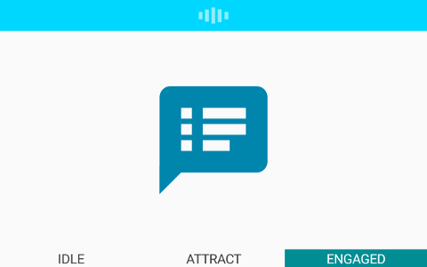

# Interaction Sample

This application demonstrates a minimal interaction flow for Pepper using the QiSDK, aimed at being a useful starting point for various interactive applications.

## Interaction State Machine

Pepper alternates between three states:

 * Idle state (Pepper doesn't do anything)
 * Attract state, when Pepper sees a human from afar (in this example, Pepper just says "hey there")
 * Engaged state, when a human is near enough to engage conversation; in this case Pepper starts a simple QiChat dialogue.

The Engaged State is slightly "sticky", in that it will not exit unless nobody has been seen for five seconds (that time can be tweaked).

In addition, Pepper's current state will be displayed at the bottom of the tablet:

## Extending the State Machine

The project contains a more generic state machine framework making it easy to add states, and change their behavior.

Each state can be associated to:

 * A *Behavior* object, that will run while this state is active and stop when it's finished (for example, say something, or run a chat)
 * A Fragment, that will be displayed on Pepper's tablet as long as that state is active

It is easy to add or change behaviors and fragments, or to add new states - all that is defined in `InteractionStateMachine`, which contains the core logic of the flow.

Two helper classes may be of interest (and could be re-used in other projects, to have a clean interaction flow):

 * `HumanInterestTracker`, that provides an interested "Human" object, defined by a human whose `intentionState` is "`INTERESTED`" or "`SEEKING_ENGAGEMENT`"
 * `HumanEngager`, that, when active, will automatically create an `EngageHuman` action with the `recommendedHumanToEngage`

See [The documentation on Human Perception](https://developer.softbankrobotics.com/pepper-qisdk/api/perceptions/reference/human) for more details on the functions used i those.
